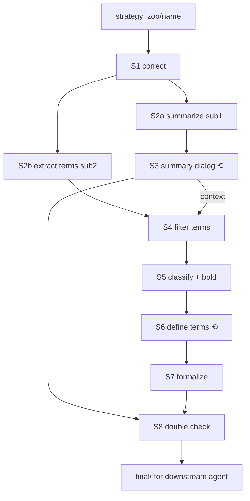

# strategy-formalizer

> **Agents: read only the English paragraphs of this skill and of every file it references. The Chinese paragraphs below each English block are for human readers and say the same thing.**
>
> **说明：本 skill 及其引用的所有文件中，agent 只需阅读英文段落；每段英文下方的中文是给人读的，内容相同。**

## 1. What this skill does / 这个 skill 做什么

This skill turns a strategy that exists only as prose (a voice transcript, a forum post, a video summary) into artifacts a downstream trading agent can execute against. The output is deliberately *not* an executable strategy: it is a description of the strategy plus a precise list of the decisions the strategy delegates to the downstream agent ("what is the major-timeframe direction right now: long / short / uncertain?"), each wrapped as a callback with all the auxiliary notes the implementer must respect. The pipeline has eight stages. Every stage ends with a hard STOP for human review, two stages (S3, S6) are multi-round dialogs with the user, and the whole run is resumable from disk after the session dies. All state lives under `workspace/<strategy_name>/`.

本 skill 把只以文字存在的策略（语音转写、论坛帖、视频总结）转换成下游交易 agent 可以据此执行的产物。产出刻意不是可执行策略，而是策略描述加上一份精确的"策略交给下游 agent 判断的决策"清单（例如"当前大周期方向是多/空/不确定？"），每个决策包装为一个回调，并附带实现者必须遵守的全部辅助说明。流水线共八个阶段，每个阶段结束都硬性停止等待人工审阅，其中 S3、S6 是与用户的多轮对话，整个运行在会话中断后可以从磁盘恢复。所有状态都在 `workspace/<策略名>/` 下。

## 2. Pipeline DAG / 流程图

The solid arrows are the stage order. `⟲` marks the two multi-round dialogs with the user. Every box ends with a STOP.

实线箭头是阶段顺序，`⟲` 表示与用户的多轮对话，每个方框结束都有一次停止。

```
strategy_zoo/<name>/ (input folder: transcript .md, analysis .md, references/)
        │
        ▼
┌──────────────────────────────────────────────────────────────────┐
│ S1  Correct typos / speech slips        → S1_strategy_raw.md      │ STOP
└──────────────────────────────────────────────────────────────────┘
        │
        ├───────────────────────────┐   (two subagents, in parallel)
        ▼                           ▼
┌───────────────────┐       ┌───────────────────────┐
│ S2a sub1 summarize│       │ S2b sub2 extract terms│
│ S2_summary_init.md│       │ S2_terms_init.json    │  STOP (after both)
└───────────────────┘       └───────────────────────┘
        │                           │
        ▼                           │
┌───────────────────────────┐       │
│ S3 ⟲ summary dialog       │       │
│ S3_summary_corrected.md   │       │  STOP
│ S3_dialog.json/.md        │       │
└───────────────────────────┘       │
        │  (context)                ▼
        │           ┌───────────────────────────────────┐
        │           │ S4 filter / correct terms         │  STOP
        │           │ S4_terms_filtered.json            │
        │           └───────────────────────────────────┘
        │                           ▼
        │           ┌───────────────────────────────────┐
        │           │ S5 classify (role × phase),       │
        │           │    bold callbacks in summary      │  STOP
        │           │ S5_categories.json                │
        │           │ S5_terms_classified.json          │
        │           │ S5_summary_marked.md              │
        │           └───────────────────────────────────┘
        │                           ▼
        │           ┌───────────────────────────────────┐
        │           │ S6 ⟲ define every term            │
        │           │ S6_terms_defined.json             │  STOP
        │           │ S6_dialog.json/.md                │
        │           │ S6_conflict_log.md                │
        │           └───────────────────────────────────┘
        │                           ▼
        │           ┌───────────────────────────────────┐
        │           │ S7 formalize                      │
        │           │ S7_formal.json  S7_term_graph.*   │  STOP
        │           │ S7_callbacks_stub.py              │
        │           └───────────────────────────────────┘
        │                           ▼
        └──────────►┌───────────────────────────────────┐
                    │ S8 double check + freeze final/   │  STOP (end)
                    │ S8_check_report.md  final/*       │
                    └───────────────────────────────────┘
                                    │
                                    ▼
                    downstream trading agent (out of scope here)
```



## 3. Stage table / 阶段一览

Each row names the stage doc to read (`stages/`), the main inputs, and the outputs that must exist before `complete`. Full file meanings are in section 7.

每行给出应阅读的阶段文档（`stages/`）、主要输入、以及 `complete` 前必须存在的产出。文件含义见第 7 节。

| Stage | Doc | Reads | Writes (required) | Dialog |
|---|---|---|---|---|
| S1 | `stages/S1_correct.md` | input folder | `S1_sources.json`, `S1_strategy_raw.md`, `S1_corrections.md` | no |
| S2 | `stages/S2_summarize_and_extract.md` | `S1_strategy_raw.md` | `S2_summary_init.md`, `S2_terms_init.json/.xlsx` | no (2 subagents) |
| S3 | `stages/S3_summary_dialog.md` | `S2_summary_init.md` | `S3_dialog.json/.md`, `S3_summary_corrected.md` | ⟲ yes |
| S4 | `stages/S4_term_filter.md` | `S2_terms_init.json`, S3 outputs | `S4_terms_filtered.json/.xlsx` | no |
| S5 | `stages/S5_term_classify.md` | `S4_terms_filtered.json`, `S3_summary_corrected.md` | `S5_categories.json`, `S5_terms_classified.json/.xlsx`, `S5_summary_marked.md` | short (scheme choice) |
| S6 | `stages/S6_term_define_dialog.md` | S5 outputs | `S6_dialog.json/.md`, `S6_terms_defined.json/.xlsx`, `S6_conflict_log.md` | ⟲ yes |
| S7 | `stages/S7_formalize.md` | `S6_terms_defined.json` | `S7_formal.json/.xlsx`, `S7_term_graph.mmd/.dot(/.png)`, `S7_callbacks_stub.py` | no |
| S8 | `stages/S8_double_check.md` | S5 summary, S6 terms, S7 formal | `S8_check_report.md`, `final/*` | no |

## 4. How to invoke and route / 调用方式与分派

The skill is invoked as `/strategy-formalizer <args>`. Route on the first word of `$ARGUMENTS`; when there are no arguments, behave as `continue`. All scripts are run **from the repo root** with `uv run python .agents/skills/strategy-formalizer/scripts/<script>.py ...`; below this prefix is abbreviated as `SF/`.

通过 `/strategy-formalizer <参数>` 调用。按 `$ARGUMENTS` 的第一个词分派；无参数时等同于 `continue`。所有脚本都**在仓库根目录**用 `uv run python .agents/skills/strategy-formalizer/scripts/<脚本>.py ...` 运行，下文缩写为 `SF/`。

- `init <folder>` — create the workspace: `SF/sf_state.py init --input <folder>`; then immediately behave as `continue`.
- `continue` (or no args) — resume: run `SF/sf_state.py status`, read its context pack, then follow section 5 or 6 depending on the current stage status.
- `status` — run `SF/sf_state.py status` and report it to the user in one short bilingual message; do nothing else.
- `reopen S<n>` — confirm with the user that stages after S<n> will be reset, then `SF/sf_state.py reopen S<n> --yes --archive`, then behave as `continue`.

## 5. The STOP protocol (after every stage) / 每个阶段后的停止协议

A stage is done when its stage doc's "done criteria" hold and all required outputs exist. Then, in this order: (1) run the validators named in the stage doc; (2) run `SF/sf_state.py complete S<n>` — this records checkpoint hashes and puts the stage in `awaiting_review`; (3) print the completion message below; (4) **end your turn**. Do not start the next stage in the same turn, even if the user seems to want it, because the stop exists so the user can edit the files. The only exception is S2, whose two subagents run in one stage.

一个阶段完成的标准是：阶段文档的"完成标准"成立且必需产出齐全。然后依次：(1) 运行阶段文档指定的校验脚本；(2) 运行 `SF/sf_state.py complete S<n>` 记录检查点并置为 `awaiting_review`；(3) 打印下面的完成消息；(4) **结束本轮**。即使用户看起来想继续，也不要在同一轮开始下一阶段，停止就是为了让用户编辑文件。唯一例外是 S2 的两个子代理在同一阶段内运行。

Completion message template (fill the brackets; keep it short):

```
S<n> <title> complete / 已完成.
Outputs / 产出:
  - workspace/<name>/<file>  — <what it holds, one line>
  ...
Review / 请审阅: <2-4 bullets: what to check or edit; which cells/sections matter>
To continue / 继续: say "继续" or run /strategy-formalizer continue.
```

## 6. The RESUME protocol (on every invocation) / 每次调用时的恢复协议

Always start with `SF/sf_state.py status`. It prints the current stage and its status, the files the user modified since the last checkpoint, any open dialog questions, and whether an `.xlsx` is newer than its `.json`. Then:

每次调用都先运行 `SF/sf_state.py status`。它会打印当前阶段及状态、上次检查点之后用户改动的文件、未回答的对话问题、以及 xlsx 是否比 json 新。然后：

1. If a stage is `awaiting_review`: re-read every file listed as modified (the user edited them during the stop); if an xlsx is newer, run `SF/sf_terms.py from-xlsx <file>.xlsx` (or `sf_formal.py from-xlsx`) first. Then run `SF/sf_state.py accept S<n>`, which advances to the next stage. Continue with step 3.
2. If a stage is `in_progress`: the previous session died mid-stage. Read the stage doc, read the outputs that already exist, and for dialog stages read the dialog json — any `open` entries are questions already asked but never answered: ask them again verbatim. Resume the stage from where the files show it stopped.
3. If the current stage is `pending`: run `SF/sf_state.py start S<n>`, read `stages/<doc>`, and execute it. Never skip a stage and never run two stages in one turn.

Nothing about the run may live only in chat. Before asking the user anything in S3/S6, write the question to the dialog json (`SF/sf_dialog.py add`), and write the answer (`answer`) before acting on it.

关于本次运行的任何信息都不能只存在于聊天中。S3/S6 向用户提问前先用 `sf_dialog.py add` 落盘，收到回答后先 `answer` 再落实。

## 7. Output file manifest / 产出文件清单

All paths are under `workspace/<strategy_name>/`. json files are the source of truth; `.xlsx` and `.md` twins are generated by scripts and merged back with `from-xlsx` / `from-md`.

所有路径在 `workspace/<策略名>/` 下。json 是真值；同名 `.xlsx`、`.md` 由脚本生成，用 `from-xlsx` / `from-md` 合并回来。

| File | Stage | What it holds / 内容 |
|---|---|---|
| `state.json` | all | Stage statuses, timestamps, checkpoint hashes, scheme id, input dir. Written by `sf_state.py`. / 阶段状态、时间戳、检查点哈希、分类方案、输入目录 |
| `S1_sources.json` | S1 | Every text file in the input folder with role `primary` (corrected and merged) / `secondary` (context only) / `ignored`. / 输入文件清单及其角色 |
| `S1_strategy_raw.md` | S1 | The corrected raw strategy text: primary sources merged under one heading per source, content otherwise unchanged. This is "the strategy" for all later stages. / 矫正后的原始策略全文 |
| `S1_corrections.md` | S1 | Table of every edit: original → corrected, reason, confidence. Lets the user reject hallucinated corrections. / 每处矫正的对照表 |
| `S2_summary_init.md` | S2 | First structured summary in the 6-section template (summary / one-liner / premise / execution steps / exit & risk / scope & params). / 初版结构化总结 |
| `S2_terms_init.json` `.xlsx` | S2 | Candidate key terms with source quotes (`status: candidate`). / 候选关键术语 |
| `S3_dialog.json` `.md` | S3 | Every question asked and answer given while clarifying and revising the summary. / S3 问答留痕 |
| `S3_summary_corrected.md` | S3 | Summary after the dialog; the human-agreed strategy. / 对话修订后的总结 |
| `S4_terms_filtered.json` `.xlsx` | S4 | Terms after applying S3 decisions: out-of-scope terms `dropped` with a `drop_reason` citing dialog ids, new terms from S3 added, ≤30 live terms ideal, ≤50 hard. / 过滤矫正后的术语 |
| `S5_categories.json` | S5 | The classification scheme used, with a bilingual legend at the top and a `needs_wrapper` flag per role. / 分类方案与中英对照 |
| `S5_terms_classified.json` `.xlsx` | S5 | Every live term with `role` and `phase`, `name_en`, and `supports` links from auxiliary to key terms. / 分类后的术语 |
| `S5_summary_marked.md` | S5 | `S3_summary_corrected.md` with every callback term's canonical name in `**bold**`; the living summary until S8. / 加粗回调术语的总结 |
| `S6_dialog.json` `.md` | S6 | Every question/answer while defining terms. / S6 问答留痕 |
| `S6_terms_defined.json` `.xlsx` | S6 | All terms `defined` with `definition_zh` and `definition_en`, including terms added during the dialog (`origin: S6_dialog`). / 已定义的术语 |
| `S6_conflict_log.md` | S6 | Contradictions found between term definitions and the summary (or between terms), and how each was resolved. / 矛盾记录与解决 |
| `S7_formal.json` `.xlsx` | S7 | Callbacks (name, invocation point, inputs, output enum, aux/constraint/parameter term ids), parameters, typed relations. / 形式化接口 |
| `S7_term_graph.mmd` `.dot` `.png` | S7 | Term relationship graph (Mermaid, Graphviz, bitmap). / 术语关系图 |
| `S7_callbacks_stub.py` | S7 | Abstract Python class: one method per callback, docstring = definition + all auxiliary notes. The downstream agent subclasses it. / 下游填充的回调桩 |
| `S8_check_report.md` | S8 | Script findings (bold ↔ terms ↔ formal consistency) plus the agent's semantic review. / 交叉核对报告 |
| `final/strategy.md` `terms.json` `formal.json` `callbacks_stub.py` | S8 | Frozen deliverables for the downstream trading agent. / 冻结交付物 |

## 8. Conventions that every stage obeys / 各阶段共同约定

- **Bilingual files.** Every `.md` and `.py` this skill writes follows `references/bilingual_style.md`: a top banner, then per section a full English block followed by the Chinese block. Never interleave sentence by sentence. Workspace content written for the user (summary bodies, definitions_zh, questions) is in Chinese; `definition_en` / `description_en` fields are English because the downstream agent reads them.
- **Bold means callback.** From S5 on, the only bold text in the summary is the canonical `name_zh` of a `role=callback` term. `sf_check.py` enforces this.
- **Terms are never deleted.** Set `status: dropped` with `drop_reason`. Ids `T###` are stable; new terms get the next id.
- **Term budget.** ≤30 live terms is the target, 50 is the hard limit (validator error). Merge or drop before adding.
- **json is truth.** Edit json or the xlsx/md twin, then run the converter; never let the twins diverge across a stop.
- **Ask on disk first.** Dialog questions go through `sf_dialog.py add` before they are asked.
- **Scope of the output.** The result describes a strategy and lists the decisions delegated to the downstream agent. Do not invent indicator formulas or data sources the text does not contain; put such suggestions in `notes` or `aux_note` terms marked as suggestions.

- **双语文件**：本 skill 写出的每个 `.md`、`.py` 都遵循 `references/bilingual_style.md`：顶部横幅，每节先整段英文再整段中文，不逐句交错。给用户看的内容（总结正文、中文定义、问题）用中文；`definition_en` / `description_en` 用英文，因为下游 agent 读英文。
- **加粗即回调**：S5 起总结中唯一允许加粗的是 `role=callback` 术语的规范中文名，`sf_check.py` 强制检查。
- **术语不删除**：改 `status: dropped` 并填 `drop_reason`；id 稳定，新术语取下一个编号。
- **术语预算**：目标 ≤30 个存活术语，硬上限 50（校验报错）。先合并或丢弃再新增。
- **json 为准**：改 json 或改 xlsx/md 副本后必须跑转换脚本，不允许跨停顿不一致。
- **先落盘再提问**：对话问题先 `sf_dialog.py add` 再问。
- **产出边界**：结果只描述策略并列出交给下游判断的决策；不要杜撰原文没有的指标公式或数据源，此类建议放在 `notes` 或标注为建议的 `aux_note` 术语里。

## 9. Script quick reference / 脚本速查

| Script | Purpose | Typical calls |
|---|---|---|
| `sf_state.py` | state machine & resume | `init --input <dir>`, `status`, `start S<n>`, `complete S<n>`, `accept S<n>`, `reopen S<n> --yes --archive`, `set-scheme <id>` |
| `sf_dialog.py` | Q/A audit trail | `--stage S3 add -q "..." --affects-terms T001`, `answer D001 -a "..."`, `close D001 -r "..."`, `to-md`, `from-md`, `list --open` |
| `sf_terms.py` | term files | `new`, `add`, `carry <src> <dst> --stage S4`, `to-xlsx <json> --categories S5_categories.json`, `from-xlsx <xlsx>`, `validate <json> [--require-classified] [--require-defined]`, `diff a b` |
| `sf_formal.py` | S7 interface | `scaffold S6_terms_defined.json S7_formal.json`, `validate S7_formal.json --terms ...`, `to-xlsx`, `from-xlsx`, `gen-stub S7_formal.json --terms ... --out S7_callbacks_stub.py` |
| `sf_graph.py` | S7 graph | `render S7_formal.json --terms S6_terms_defined.json --png` |
| `sf_check.py` | S8 checks & freeze | `run [--lenient]`, `freeze` |

Every script prints bilingual lines prefixed `[sf]`; a non-zero exit means a validation error that must be fixed before `complete`.

每个脚本输出以 `[sf]` 开头的双语信息；非零退出码表示必须在 `complete` 前修复的校验错误。

## 10. Files in this skill / skill 目录结构

```
SKILL.md                      this file: DAG, routing, protocols, manifest
stages/S1..S8_*.md            one instruction doc per stage (goal, inputs, procedure, done criteria, stop message)
agents/sub1_summarizer.md     prompt for the S2 summary subagent
agents/sub2_term_extractor.md prompt for the S2 term-extraction subagent
templates/                    summary skeleton, category schemes (3), state template, stub header
schemas/                      JSON schemas for state / sources / term / dialog / formal files
references/classification_schemes.md   the three classification schemes with worked examples
references/consistency_rules.md        checklist for S6/S8 contradiction detection
references/bilingual_style.md          documentation and docstring conventions
scripts/sf_*.py               the tools listed in section 9
tests/                        pytest suite (`uv run pytest` from the repo root)
```
