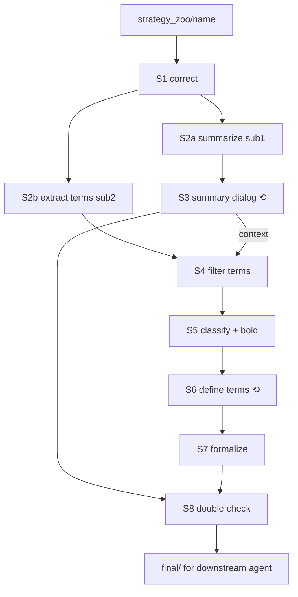

# strategy-formalizer

> **Agents: follow the English part of this file only (everything above the "中文版" divider). The Chinese part below it is a translation for human readers and adds no instructions. The same rule holds for every file this skill references.**
>
> **说明：agent 执行时只需参考本文件上半部分的英文；"中文版"分隔线之后的中文仅供人类阅读，内容与英文相同，不包含额外指令。本 skill 引用的所有文件都遵循同一规则。**

## 1. What this skill does

This skill turns a strategy that exists only as prose (a voice transcript, a forum post, a video summary) into artifacts a downstream trading agent can execute against. The output is deliberately *not* an executable strategy: it is a description of the strategy plus a precise list of the decisions the strategy delegates to the downstream agent ("what is the major-timeframe direction right now: long / short / uncertain?"), each wrapped as a callback with all the auxiliary notes the implementer must respect. The pipeline has eight stages. Every stage ends with a hard STOP for human review, two stages (S3, S6) are multi-round dialogs with the user, and the whole run is resumable from disk after the session dies. All state lives under `workspace/<strategy_name>/`.

## 2. Pipeline DAG

Solid arrows are the stage order. `⟲` marks the two multi-round dialogs with the user. Every box ends with a STOP.

```
strategy_zoo/<name>/ (input folder: transcript .md, analysis .md, references/)
        │
        ▼
┌──────────────────────────────────────────────────────────────────┐
│ S1  Correct typos / speech slips        → S1_strategy_raw.md      │ STOP
│     + organise into sectioned markdown  → S1_strategy_clean.md    │
└──────────────────────────────────────────────────────────────────┘
        │
        ├───────────────────────────┐   (two subagents, in parallel)
        ▼                           ▼
┌───────────────────┐       ┌───────────────────────┐
│ S2a sub1 summarize│       │ S2b sub2 extract terms│
│ S2_summary_init.md│       │ S2_terms_init.json    │  STOP (after both)
└───────────────────┘       └───────────────────────┘
        │                           │
        ▼                           │
┌───────────────────────────┐       │
│ S3 ⟲ summary dialog       │       │
│ S3_summary_corrected.md   │       │  STOP
│ S3_dialog.json/.md        │       │
└───────────────────────────┘       │
        │  (context)                ▼
        │           ┌───────────────────────────────────┐
        │           │ S4 filter / correct terms         │  STOP
        │           │ S4_terms_filtered.json            │
        │           └───────────────────────────────────┘
        │                           ▼
        │           ┌───────────────────────────────────┐
        │           │ S5 classify (role × phase),       │
        │           │    bold callbacks in summary      │  STOP
        │           │ S5_categories.json                │
        │           │ S5_terms_classified.json          │
        │           │ S5_summary_marked.md              │
        │           └───────────────────────────────────┘
        │                           ▼
        │           ┌───────────────────────────────────┐
        │           │ S6 ⟲ define every term            │
        │           │ S6_terms_defined.json             │  STOP
        │           │ S6_dialog.json/.md                │
        │           │ S6_conflict_log.md                │
        │           └───────────────────────────────────┘
        │                           ▼
        │           ┌───────────────────────────────────┐
        │           │ S7 formalize                      │
        │           │ S7_formal.json  S7_term_graph.*   │  STOP
        │           │ S7_callbacks_stub.py              │
        │           │ S7_strategy_driver.py (flow→code) │
        │           └───────────────────────────────────┘
        │                           ▼
        └──────────►┌───────────────────────────────────┐
                    │ S8 double check + freeze final/   │  STOP (end)
                    │ S8_check_report.md  final/*       │
                    └───────────────────────────────────┘
                                    │
                                    ▼
                    downstream trading agent (out of scope here)
```



## 3. Stage table

Each row names the stage doc to read (`stages/`), the main inputs, and the outputs that must exist before `complete`. Full file meanings are in section 7.

| Stage | Doc | Reads | Writes (required) | Dialog |
|---|---|---|---|---|
| S1 | `stages/S1_correct.md` | input folder | `S1_sources.json`, `S1_strategy_raw.md`, `S1_corrections.md`, `S1_strategy_clean.md` | no |
| S2 | `stages/S2_summarize_and_extract.md` | `S1_strategy_clean.md` (+ `S1_strategy_raw.md` for timestamps) | `S2_summary_init.md`, `S2_terms_init.json/.xlsx` | no (2 subagents) |
| S3 | `stages/S3_summary_dialog.md` | `S2_summary_init.md` | `S3_dialog.json/.md`, `S3_summary_corrected.md` | ⟲ yes |
| S4 | `stages/S4_term_filter.md` | `S2_terms_init.json`, S3 outputs | `S4_terms_filtered.json/.xlsx` | no |
| S5 | `stages/S5_term_classify.md` | `S4_terms_filtered.json`, `S3_summary_corrected.md` | `S5_categories.json`, `S5_terms_classified.json/.xlsx`, `S5_summary_marked.md` | short (scheme choice) |
| S6 | `stages/S6_term_define_dialog.md` | S5 outputs | `S6_dialog.json/.md`, `S6_terms_defined.json/.xlsx`, `S6_conflict_log.md` | ⟲ yes |
| S7 | `stages/S7_formalize.md` | `S6_terms_defined.json`, `S5_summary_marked.md` §4 | `S7_formal.json/.xlsx` (incl. `flow`), `S7_term_graph.mmd/.dot(/.pdf)`, `S7_callbacks_stub.py`, `S7_strategy_driver.py` | no |
| S8 | `stages/S8_double_check.md` | S5 summary, S6 terms, S7 formal | `S8_check_report.md`, `final/*` | no |

## 4. How to invoke and route

The skill is invoked as `/strategy-formalizer <args>`. Route on the first word of `$ARGUMENTS`; with no arguments behave as `continue`. All scripts are run **from the repo root** with `uv run python .agents/skills/strategy-formalizer/scripts/<script>.py ...`; below this prefix is abbreviated as `SF/`.

- `init <folder>` — create the workspace: `SF/sf_state.py init --input <folder>`; then immediately behave as `continue`.
- `continue` (or no args) — resume: run `SF/sf_state.py status`, read its context pack, then follow section 5 or 6 depending on the current stage status.
- `status` — run `SF/sf_state.py status` and report it to the user in one short message; do nothing else.
- `reopen S<n>` — confirm with the user that stages after S<n> will be reset, then `SF/sf_state.py reopen S<n> --yes --archive`, then behave as `continue`.

## 5. The STOP protocol (after every stage)

A stage is done when its stage doc's "done criteria" hold and all required outputs exist. Then, in this order: (1) run the validators named in the stage doc; (2) run `SF/sf_state.py complete S<n>`, which records checkpoint hashes and puts the stage in `awaiting_review`; (3) print the completion message below; (4) **end your turn**. Do not start the next stage in the same turn, even if the user seems to want it, because the stop exists so the user can edit the files. Two exceptions: S2's two subagents run in one stage, and `complete S8` marks the run done directly (freezing `final/` is the end; no `accept` follows).

Completion message template (fill the brackets; keep it short; write it in the user's language):

```
S<n> <title> complete / 已完成.
Outputs / 产出:
  - workspace/<name>/<file>  — <what it holds, one line>
  ...
Review / 请审阅: <2-4 bullets: what to check or edit; which cells/sections matter>
To continue / 继续: say "继续" or run /strategy-formalizer continue.
```

## 6. The RESUME protocol (on every invocation)

Always start with `SF/sf_state.py status`. It prints the current stage and its status, the files the user modified since the last checkpoint (content-level: re-saving an `.xlsx` in Excel without changing cells does not count), any open dialog questions, and whether an `.xlsx` was edited after its `.json`. Then:

1. If the current stage is `awaiting_review`: re-read every file listed as modified (the user edited them during the stop); if an xlsx is newer, run `SF/sf_terms.py from-xlsx <file>.xlsx` (or `sf_formal.py from-xlsx`) first. Then run `SF/sf_state.py accept S<n>`, which advances to the next stage. Continue with step 3.
2. If the current stage is `in_progress`: the previous session died mid-stage. Read the stage doc, read the outputs that already exist, and for dialog stages read the dialog json; any `open` entries are questions already asked but never answered, so ask them again verbatim. Resume the stage from where the files show it stopped.
3. If the current stage is `pending`: run `SF/sf_state.py start S<n>`, read `stages/<doc>`, and execute it. Never skip a stage and never run two stages in one turn.

Nothing about the run may live only in chat. Before asking the user anything in S3/S6, write the question to the dialog json (`SF/sf_dialog.py add`), ask that one question, end the turn, and write the answer (`answer`) before acting on it. At most one dialog entry is `open` at any time.

## 7. Output file manifest

All paths are under `workspace/<strategy_name>/`. json files are the source of truth; `.xlsx` and `.md` twins are generated by scripts and merged back with `from-xlsx` / `from-md`.

| File | Stage | What it holds |
|---|---|---|
| `state.json` | all | Stage statuses, timestamps, checkpoint hashes, scheme id, input dir. Written by `sf_state.py`. |
| `S1_sources.json` | S1 | Every text file in the input folder with role `primary` (corrected and merged) / `secondary` (context only) / `ignored`. |
| `S1_strategy_raw.md` | S1 | The corrected raw text with its original line/timestamp structure: primary sources merged under one heading per source, content otherwise unchanged. The traceability reference for quotes. |
| `S1_corrections.md` | S1 | Table of every edit: original → corrected, reason, confidence. Lets the user reject hallucinated corrections. |
| `S1_strategy_clean.md` | S1 | The same corrected text reorganised into a readable Markdown document: topic headings (each with its timestamp range), paragraphs instead of timestamp lines, lists where the text enumerates steps. Complete, not summarised (`sf_check.py s1-coverage` verifies). This is "the strategy" that S2 reads. |
| `S2_summary_init.md` | S2 | First structured summary in the 6-section template (summary / one-liner / premise / execution steps / exit & risk / scope & params). |
| `S2_terms_init.json` `.xlsx` | S2 | Candidate key terms with source quotes (`status: candidate`). |
| `S3_dialog.json` `.md` | S3 | Every question asked and answer given while clarifying and revising the summary. |
| `S3_summary_corrected.md` | S3 | Summary after the dialog; the human-agreed strategy. |
| `S4_terms_filtered.json` `.xlsx` | S4 | Terms after applying S3 decisions: out-of-scope terms `dropped` with a `drop_reason` citing dialog ids, new terms from S3 added; ≤30 live terms ideal, ≤50 hard. |
| `S5_categories.json` | S5 | The classification scheme used, with a bilingual legend at the top and a `needs_wrapper` flag per role. |
| `S5_terms_classified.json` `.xlsx` | S5 | Every live term with `role` and `phase`, `name_en`, and `supports` links from auxiliary to key terms. |
| `S5_summary_marked.md` | S5 | `S3_summary_corrected.md` with every callback term's canonical name in `**bold**`; the living summary until S8. |
| `S6_dialog.json` `.md` | S6 | Every question/answer while defining terms. |
| `S6_terms_defined.json` `.xlsx` | S6 | All terms `defined` with `definition_zh` and `definition_en`, including terms added during the dialog (`origin: S6_dialog`). |
| `S6_conflict_log.md` | S6 | Contradictions found between term definitions and the summary (or between terms), and how each was resolved. |
| `S7_formal.json` `.xlsx` | S7 | Callbacks (name, invocation point, inputs, output enum, aux/constraint/parameter term ids), parameters, typed relations, and the `flow` (states + ordered rules + dry-run scenarios) that wires the callbacks; see `references/flow_dsl.md`. |
| `S7_term_graph.mmd` `.dot` `.pdf` | S7 | Term relationship graph (Mermaid, Graphviz source, PDF rendering). |
| `S7_callbacks_stub.py` | S7 | Standard interface dataclasses (Bar, MarketData, Instrument, Position, EntryDecision, StopDistance) plus an abstract class with one typed method per callback, docstring = definition + all auxiliary notes. The downstream agent subclasses it. |
| `S7_strategy_driver.py` | S7 | Generated from `flow`: `StrategyDriver.on_event(event, ctx)` runs the rules scheduled for that event (tick / minor_bar / major_bar / timer), reads the other callbacks' last results from a signal cache, and returns `Action`s (enter / set_stop / close); the downstream agent executes them via its `ExecutionPort`. Includes the runtime (Account sizing, stop-hit test on tick, async-aware callback calls, RecordingPort for dry-runs). |
| `S8_check_report.md` | S8 | Script findings (bold ↔ terms ↔ formal consistency) plus the agent's semantic review. |
| `final/strategy.md` `terms.json` `formal.json` `callbacks_stub.py` `strategy_driver.py` | S8 | Frozen deliverables for the downstream trading agent. |

## 8. Conventions that every stage obeys

- **Bilingual files.** Every `.md` this skill writes follows `references/bilingual_style.md`: a banner, the complete English text, a "中文版" divider, the complete Chinese text. Never alternate languages inside the English part. Workspace content written for the user (summary bodies, `definition_zh`, dialog questions) is Chinese; `definition_en` / `description_en` fields are English because the downstream agent reads them.
- **Bold means callback.** From S5 on, the only bold text in the summary is the canonical `name_zh` of a `role=callback` term. `sf_check.py` enforces this.
- **Terms are never deleted.** Set `status: dropped` with `drop_reason`. Ids `T###` are stable; new terms get the next id.
- **Term budget.** ≤30 live terms is the target, 50 is the hard limit (validator error). Merge or drop before adding.
- **json is truth.** Edit json or the xlsx/md twin, then run the converter; never let the twins diverge across a stop.
- **Ask on disk first.** Dialog questions go through `sf_dialog.py add` before they are asked.
- **One atomic question per turn.** In S3 and S6 ask exactly one question, about exactly one thing, then end the turn and wait. Never bundle sub-questions ("which instruments, which contract, which session?" is three questions). Offer lettered options when they help, always allowing a free answer. Log the answer and apply it before asking the next question.
- **Scope of the output.** The result describes a strategy and lists the decisions delegated to the downstream agent. Do not invent indicator formulas or data sources the text does not contain; put such suggestions in `notes` or in `aux_note` terms marked as suggestions.
- **Silence is not a gap.** What the text does not mention (instrument universe, contract, session, sizing, re-entry…) is the downstream agent's concern: it is not written into the summary, not marked `[待确认]`, and not asked about in S3 unless the user raises it. `[待确认]` marks and S3 questions are only for ambiguities in what the text does say.

## 9. Script quick reference

| Script | Purpose | Typical calls |
|---|---|---|
| `sf_state.py` | state machine & resume | `init --input <dir>`, `status`, `start S<n>`, `complete S<n>`, `accept S<n>`, `reopen S<n> --yes --archive`, `set-scheme <id>` |
| `sf_dialog.py` | Q/A audit trail | `--stage S3 add -q "..." --affects-terms T001`, `answer D001 -a "..."`, `close D001 -r "..."`, `to-md`, `from-md`, `list --open` |
| `sf_terms.py` | term files | `new`, `add`, `carry <src> <dst> --stage S4`, `to-xlsx <json> --categories S5_categories.json`, `from-xlsx <xlsx>`, `validate <json> [--require-classified] [--require-defined]`, `diff a b` |
| `sf_formal.py` | S7 interface | `scaffold S6_terms_defined.json S7_formal.json`, `validate S7_formal.json --terms ...`, `to-xlsx`, `from-xlsx`, `gen-stub S7_formal.json --terms ... --out S7_callbacks_stub.py` |
| `sf_driver.py` | S7 control flow → driver | `validate S7_formal.json`, `gen S7_formal.json --terms ... --out S7_strategy_driver.py`, `dryrun S7_formal.json` |
| `sf_graph.py` | S7 graph | `render S7_formal.json --terms S6_terms_defined.json --pdf` |
| `sf_check.py` | S1 coverage, S8 checks & freeze | `s1-coverage`, `run [--lenient]`, `freeze` |

Every script prints lines prefixed `[sf]`; a non-zero exit means a validation error that must be fixed before `complete`.

## 10. Files in this skill

```
SKILL.md                      this file: DAG, routing, protocols, manifest
stages/S1..S8_*.md            one instruction doc per stage (goal, inputs, procedure, done criteria, stop message)
agents/sub1_summarizer.md     prompt for the S2 summary subagent
agents/sub2_term_extractor.md prompt for the S2 term-extraction subagent
templates/                    summary skeleton, category schemes (3), state template, stub header, driver runtime
schemas/                      JSON schemas for state / sources / term / dialog / formal files
references/classification_schemes.md   the three classification schemes with worked examples
references/consistency_rules.md        checklist for S6/S8 contradiction detection
references/flow_dsl.md                 the flow rule language that wires callbacks into the driver
references/bilingual_style.md          documentation and docstring conventions
scripts/sf_*.py               the tools listed in section 9
tests/                        pytest suite (`uv run pytest` from the repo root)
```

---

# 中文版（仅供人类阅读；agent 请参考上方英文）

## 1. 这个 skill 做什么

本 skill 把只以文字存在的策略（语音转写、论坛帖、视频总结）转换成下游交易 agent 可以据此执行的产物。产出刻意**不是**可执行策略，而是策略描述加上一份精确的"策略交给下游 agent 判断的决策"清单（例如"当前大周期方向是多/空/不确定？"），每个决策包装为一个回调，并附带实现者必须遵守的全部辅助说明。流水线共八个阶段，每个阶段结束都硬性停止等待人工审阅，其中 S3、S6 是与用户的多轮对话，整个运行在会话中断后可以从磁盘恢复。所有状态都在 `workspace/<策略名>/` 下。

## 2. 流程图

实线箭头是阶段顺序，`⟲` 表示与用户的多轮对话，每个方框结束都有一次停止。图见上方英文部分（ASCII 图与 Mermaid 图），此处不重复。

## 3. 阶段一览

每行给出应阅读的阶段文档（`stages/`）、主要输入、以及 `complete` 前必须存在的产出。文件含义见第 7 节。

| 阶段 | 文档 | 读取 | 写入（必需） | 对话 |
|---|---|---|---|---|
| S1 | `stages/S1_correct.md` | 输入目录 | `S1_sources.json`、`S1_strategy_raw.md`、`S1_corrections.md`、`S1_strategy_clean.md` | 无 |
| S2 | `stages/S2_summarize_and_extract.md` | `S1_strategy_clean.md`（另以 `S1_strategy_raw.md` 查时间戳） | `S2_summary_init.md`、`S2_terms_init.json/.xlsx` | 无（两个子代理） |
| S3 | `stages/S3_summary_dialog.md` | `S2_summary_init.md` | `S3_dialog.json/.md`、`S3_summary_corrected.md` | ⟲ 有 |
| S4 | `stages/S4_term_filter.md` | `S2_terms_init.json`、S3 产出 | `S4_terms_filtered.json/.xlsx` | 无 |
| S5 | `stages/S5_term_classify.md` | `S4_terms_filtered.json`、`S3_summary_corrected.md` | `S5_categories.json`、`S5_terms_classified.json/.xlsx`、`S5_summary_marked.md` | 简短（选分类方案） |
| S6 | `stages/S6_term_define_dialog.md` | S5 产出 | `S6_dialog.json/.md`、`S6_terms_defined.json/.xlsx`、`S6_conflict_log.md` | ⟲ 有 |
| S7 | `stages/S7_formalize.md` | `S6_terms_defined.json`、`S5_summary_marked.md` 第 4 节 | `S7_formal.json/.xlsx`（含 `flow`）、`S7_term_graph.mmd/.dot(/.pdf)`、`S7_callbacks_stub.py`、`S7_strategy_driver.py` | 无 |
| S8 | `stages/S8_double_check.md` | S5 总结、S6 术语、S7 形式化 | `S8_check_report.md`、`final/*` | 无 |

## 4. 调用方式与分派

通过 `/strategy-formalizer <参数>` 调用。按 `$ARGUMENTS` 的第一个词分派；无参数时等同于 `continue`。所有脚本都**在仓库根目录**用 `uv run python .agents/skills/strategy-formalizer/scripts/<脚本>.py ...` 运行，下文缩写为 `SF/`。

- `init <目录>` —— 创建 workspace：`SF/sf_state.py init --input <目录>`，然后立即按 `continue` 处理。
- `continue`（或无参数）—— 恢复：运行 `SF/sf_state.py status`，读取它输出的上下文包，再根据当前阶段状态执行第 5 或第 6 节。
- `status` —— 运行 `SF/sf_state.py status`，用一条简短消息向用户汇报，不做其他事。
- `reopen S<n>` —— 与用户确认 S<n> 之后的阶段会被重置，然后 `SF/sf_state.py reopen S<n> --yes --archive`，再按 `continue` 处理。

## 5. 每个阶段后的停止协议

一个阶段完成的标准是：阶段文档的"完成标准"成立且必需产出齐全。然后依次：(1) 运行阶段文档指定的校验脚本；(2) 运行 `SF/sf_state.py complete S<n>`，记录检查点哈希并置为 `awaiting_review`；(3) 打印完成消息（模板见英文部分）；(4) **结束本轮**。即使用户看起来想继续，也不要在同一轮开始下一阶段，停止就是为了让用户编辑文件。两个例外：S2 的两个子代理在同一阶段内运行；`complete S8` 直接标记本次运行 done（冻结 `final/` 即结束，之后没有 `accept`）。

完成消息内容：阶段名与标题、每个产出文件及其一行说明、2~4 条"请审阅"要点（看什么、改哪些单元格或章节）、以及如何继续（说"继续"或运行 `/strategy-formalizer continue`）。

## 6. 每次调用时的恢复协议

每次调用都先运行 `SF/sf_state.py status`。它会打印当前阶段及状态、上次检查点之后用户改动的文件（按内容比较：用 Excel 打开保存但未改单元格不算）、未回答的对话问题、以及 xlsx 是否在 json 之后被编辑。然后：

1. 当前阶段为 `awaiting_review`：重新阅读所有被列为已修改的文件（用户在停顿期间改的）；若 xlsx 更新，先运行 `SF/sf_terms.py from-xlsx <文件>.xlsx`（或 `sf_formal.py from-xlsx`）。然后运行 `SF/sf_state.py accept S<n>` 推进到下一阶段，转第 3 步。
2. 当前阶段为 `in_progress`：上一个会话在阶段中途中断。阅读阶段文档和已存在的产出；对话阶段还要读对话 json，其中 `open` 条目是问过但没得到回答的问题，原样再问一次。从文件显示的中断处继续。
3. 当前阶段为 `pending`：运行 `SF/sf_state.py start S<n>`，阅读 `stages/<文档>` 并执行。绝不跳过阶段，绝不在一轮里跑两个阶段。

关于本次运行的任何信息都不能只存在于聊天中。S3/S6 向用户提问前先用 `SF/sf_dialog.py add` 落盘，只问这一个问题，结束本轮；收到回答后先 `answer` 再落实。任何时刻最多只有一个 `open` 的对话条目。

## 7. 产出文件清单

所有路径在 `workspace/<策略名>/` 下。json 是真值；同名 `.xlsx`、`.md` 由脚本生成，用 `from-xlsx` / `from-md` 合并回来。

| 文件 | 阶段 | 内容 |
|---|---|---|
| `state.json` | 全部 | 阶段状态、时间戳、检查点哈希、分类方案 id、输入目录。由 `sf_state.py` 写入。 |
| `S1_sources.json` | S1 | 输入目录中每个文本文件及其角色：`primary`（矫正并合并）/ `secondary`（仅作背景）/ `ignored`。 |
| `S1_strategy_raw.md` | S1 | 矫正后、保留原有行/时间戳结构的原文：primary 来源按文件各自一个标题合并，内容不作其他改动。引用溯源的依据。 |
| `S1_corrections.md` | S1 | 每处修改的对照表：原文 → 修改后、原因、置信度。让用户能否决臆造的修改。 |
| `S1_strategy_clean.md` | S1 | 同一份矫正后文本重新组织成可读的 Markdown 文档：按主题分节（标题带时间戳范围）、段落代替时间戳行、原文列举步骤处用列表。完整而非摘要（`sf_check.py s1-coverage` 校验）。S2 阅读的"策略"就是它。 |
| `S2_summary_init.md` | S2 | 六节模板（策略总结 / 一句话概述 / 前提与理念 / 执行步骤 / 出场与风控 / 适用范围与参数）的初版结构化总结。 |
| `S2_terms_init.json` `.xlsx` | S2 | 带原文引用的候选关键术语（`status: candidate`）。 |
| `S3_dialog.json` `.md` | S3 | 澄清与修订总结过程中的每个问题与回答。 |
| `S3_summary_corrected.md` | S3 | 对话之后的总结；用户认可的策略。 |
| `S4_terms_filtered.json` `.xlsx` | S4 | 应用 S3 决定后的术语：超出范围的术语标 `dropped` 并在 `drop_reason` 引用对话 id，S3 产生的新术语已加入；理想 ≤30 个存活术语，硬上限 50。 |
| `S5_categories.json` | S5 | 使用的分类方案，顶部有中英对照表，每个 role 有 `needs_wrapper` 标记。 |
| `S5_terms_classified.json` `.xlsx` | S5 | 每个存活术语的 `role`、`phase`、`name_en`，以及辅助术语指向关键术语的 `supports`。 |
| `S5_summary_marked.md` | S5 | 在 `S3_summary_corrected.md` 基础上把每个回调术语的规范名 `**加粗**`；S8 之前的"活"总结。 |
| `S6_dialog.json` `.md` | S6 | 定义术语过程中的每个问答。 |
| `S6_terms_defined.json` `.xlsx` | S6 | 全部术语 `defined`，含 `definition_zh` 与 `definition_en`，包括对话中新增的术语（`origin: S6_dialog`）。 |
| `S6_conflict_log.md` | S6 | 术语定义与总结之间（或术语之间）发现的矛盾及其解决方式。 |
| `S7_formal.json` `.xlsx` | S7 | 回调（名称、调用位置、输入、输出枚举、辅助/约束/参数术语 id）、参数、带类型的关系，以及把回调串起来的 `flow`（状态 + 有序规则 + dry-run 场景）；见 `references/flow_dsl.md`。 |
| `S7_term_graph.mmd` `.dot` `.pdf` | S7 | 术语关系图（Mermaid、Graphviz 源文件、PDF 渲染）。 |
| `S7_callbacks_stub.py` | S7 | 标准接口 dataclass（Bar、MarketData、Instrument、Position、EntryDecision、StopDistance）加抽象类：每个回调一个带类型的方法，docstring = 定义 + 全部辅助说明。下游 agent 继承它实现。 |
| `S7_strategy_driver.py` | S7 | 由 `flow` 生成：`StrategyDriver.on_event(event, ctx)` 执行该事件（tick / minor_bar / major_bar / timer）上调度的规则，其他回调的上次结果从信号缓存读取，返回 `Action`（enter / set_stop / close），下游 agent 通过自己的 `ExecutionPort` 执行。内含运行时（按风险算仓位、tick 上的止损触发判断、异步感知的回调调用、dry-run 用的 RecordingPort）。 |
| `S8_check_report.md` | S8 | 脚本发现（加粗 ↔ 术语 ↔ 形式化的一致性）加上 agent 的语义审查。 |
| `final/strategy.md` `terms.json` `formal.json` `callbacks_stub.py` `strategy_driver.py` | S8 | 冻结后交付给下游交易 agent 的文件。 |

## 8. 各阶段共同约定

- **双语文件**：本 skill 写出的每个 `.md` 都遵循 `references/bilingual_style.md`：顶部横幅、完整英文、"中文版"分隔线、完整中文。英文部分内不夹杂中文段落。给用户看的 workspace 内容（总结正文、`definition_zh`、对话问题）用中文；`definition_en` / `description_en` 用英文，因为下游 agent 读这些字段。
- **加粗即回调**：S5 起总结中唯一允许加粗的是 `role=callback` 术语的规范中文名，`sf_check.py` 强制检查。
- **术语不删除**：改 `status: dropped` 并填 `drop_reason`；id `T###` 稳定，新术语取下一个编号。
- **术语预算**：目标 ≤30 个存活术语，硬上限 50（校验报错）。先合并或丢弃再新增。
- **json 为准**：改 json 或改 xlsx/md 副本后必须跑转换脚本，不允许跨停顿不一致。
- **先落盘再提问**：对话问题先 `sf_dialog.py add` 再问。
- **每轮只问一个原子问题**：S3、S6 每次只提一个问题、只问一件事，然后结束本轮等待回答。绝不打包子问题（"做什么品种、哪个合约、哪个时段？"是三个问题）。有帮助时给出字母选项，但始终允许自由回答。记录并落实回答之后再问下一个。
- **产出边界**：结果只描述策略并列出交给下游判断的决策；不要杜撰原文没有的指标公式或数据源，此类建议放在 `notes` 或标注为建议的 `aux_note` 术语里。
- **原文没说不算缺口**：原文没提的方面（品种范围、合约、时段、仓位、再入场……）是下游 agent 的事：不写进总结、不标 `[待确认]`、S3 也不问（除非用户主动提出）。`[待确认]` 和 S3 的问题只针对原文说了但说得含糊的地方。

## 9. 脚本速查

| 脚本 | 用途 | 常用调用 |
|---|---|---|
| `sf_state.py` | 状态机与恢复 | `init --input <目录>`、`status`、`start S<n>`、`complete S<n>`、`accept S<n>`、`reopen S<n> --yes --archive`、`set-scheme <id>` |
| `sf_dialog.py` | 问答留痕 | `--stage S3 add -q "..." --affects-terms T001`、`answer D001 -a "..."`、`close D001 -r "..."`、`to-md`、`from-md`、`list --open` |
| `sf_terms.py` | 术语文件 | `new`、`add`、`carry <源> <目标> --stage S4`、`to-xlsx <json> --categories S5_categories.json`、`from-xlsx <xlsx>`、`validate <json> [--require-classified] [--require-defined]`、`diff a b` |
| `sf_formal.py` | S7 接口 | `scaffold S6_terms_defined.json S7_formal.json`、`validate S7_formal.json --terms ...`、`to-xlsx`、`from-xlsx`、`gen-stub S7_formal.json --terms ... --out S7_callbacks_stub.py` |
| `sf_driver.py` | S7 控制流 → driver | `validate S7_formal.json`、`gen S7_formal.json --terms ... --out S7_strategy_driver.py`、`dryrun S7_formal.json` |
| `sf_graph.py` | S7 关系图 | `render S7_formal.json --terms S6_terms_defined.json --pdf` |
| `sf_check.py` | S1 覆盖检查、S8 检查与冻结 | `s1-coverage`、`run [--lenient]`、`freeze` |

每个脚本输出以 `[sf]` 开头的信息；非零退出码表示必须在 `complete` 前修复的校验错误。

## 10. skill 目录结构

```
SKILL.md                      本文件：流程图、分派、协议、文件清单
stages/S1..S8_*.md            每个阶段一份说明（目标、输入、步骤、完成标准、停止消息）
agents/sub1_summarizer.md     S2 总结子代理的提示词
agents/sub2_term_extractor.md S2 术语提取子代理的提示词
templates/                    总结骨架、分类方案（3 种）、状态模板、桩代码头部、driver 运行时
schemas/                      state / sources / term / dialog / formal 文件的 JSON schema
references/classification_schemes.md   三种分类方案及示例
references/consistency_rules.md        S6/S8 矛盾检查清单
references/flow_dsl.md                 把回调串成 driver 的 flow 规则语言
references/bilingual_style.md          文档与 docstring 的双语规范
scripts/sf_*.py               第 9 节列出的工具
tests/                        pytest 测试（在仓库根目录运行 uv run pytest）
```
